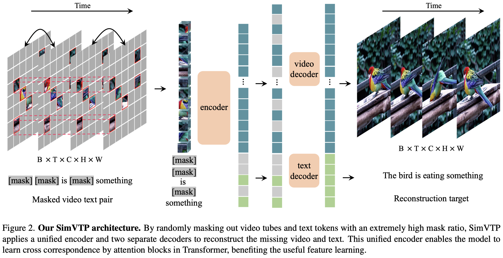
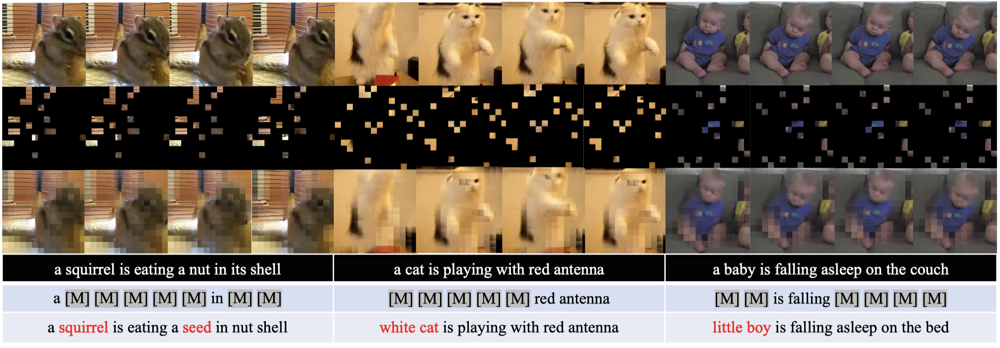

<div align="center">

# 🚀 **SimVTP**: Simple Video Text Pre-training with Masked Autoencoders

<a href="https://pytorch.org/get-started/locally/"></a> &emsp; [](https://arxiv.org/pdf/2212.03490) &emsp; [](#PyTorch)

</div>

## 🍃 Abstract
SimVTP: a Simple Video-Text Pretraining framework via masked autoencoders. We randomly mask out the spatial-temporal tubes of input video and the word tokens of input text and then feed them into a unified autencoder to reconstruct the missing pixels and words. 

Our SimVTP has several properties: 
- Thanks to the unified autoencoder,  SimVTP reconstructs the masked signal of one modality with the help from another modality, which implicitly learns the cross-modal alignment between video tubes and text tokens. 
- SimVTP not only benefits from a high video masking ratio (e.g. 90%) due to the temporal redundancy of video, but also needs a high text masking ratio (e.g. 75%), which is much higher than BERT (e.g. 15%), to achieve optimal performance.  
- Equipping SimVTP with video-text contrastive learning (VTC) and video-text matching (VTM), which are two commonly used cross-modal training strategies, could further improve the transferable performance significantly. 
- SimVTP is data-efficient, e.g., pre-training only on 10% data of WebVid-2M, SimVTP achieves surprisingly good results (43.8 R@1) on MSRVTT, which is far above recent state-of-the-art methods pre-trained on both CC3M and WebVid-2M.  




## 🔥 Main Results on Downstream Tasks
### Text-to-video Retrieval on MSR-VTT


|  Method   | Vis Enc.Init | Pre-trained Data |  #pairs |  R@1 | R@5 | R@10 | MdR |
| :------:  | :------:     | :---:            | :---:   | :-----: | :---: | :---: |:---: | 
| HERO  | ImageNet, Kinetics | HowTo100M   | 136M   | 16.8 | 43.4 | 57.7 | - | 
| AVLnet  | ImageNet, Kinetics | HowTo100M   | 136M   | 27.1 | 55.6 | 66.6 | 4 | 
| Frozen  | ImageNet           | WebVid2M+CC3M   | 5.5M   | 31.0 | 59.5 | 70.5 | 3 | 
| OATrans  | ImageNet           | WebVid2M+CC3M   | 5.5M   | 35.8 | 63.4 | 76.5 | 3 | 
| RegionLearner  | ImageNet           | WebVid2M+CC3M   | 5.5M   | 36.3 | 63.9 | 72.5 | 3 | 
| LocVTP  | ImageNet           | WebVid2M+CC3M   | 5.5M   | 36.5 | 64.3 | 76.8 | 3 | 
| BFormer  | ImageNet           | WebVid2M+CC3M   | 5.5M   | 37.6 | 64.8 | 75.1 | 3 | 
| **SimVTP(ours)**  | Kinetics           | WebVid2M   | 2.5M   | **53.6** | **81.9** | **90.7** | **3** | 


<!-- ## 🔨 Dependencies and Installation


- Python >= 3.6 
- PyTorch >= 1.6.0
- NVIDIA GPU + CUDA

### ⛺ Installation
1. Clone repo
    ```bash
    git clone XXXX
    cd SimVTP
    ```
2. Install dependent packages
    ```bash
    pip install -r requirements.txt
    ```

## 🔅 Data Preparation
Please refer to [`DATA.md`](DATA.md)  for pre-training and downstream evaluation datasets.

## 🌿 Pre-training
We pretrain our SimVTP on video dataset WebVid-2M with 64 V100 GPU (8 nodes x 8 GPUs). The implementation of our SimVTP supports multi-node distributed training. We provide the scripts in the [scripts folder](scripts). 

```bash
bash scripts/pretrain_webvid.sh
```
you could run the scripts respectively. `--master_addr` is set as the ip of the node 0 and `--node_rank` is set from 0 to 7.


## 🍄 Fine-tuning on MSRVTT
We finetune our SimVTP on MSRVTT with 8 V100. We provide the scripts in the [scripts folder](scripts). 
```bash
bash scripts/finetune_msrvtt.sh
``` 
You could also add the `--only_test` to evaluate our finetuned model.

## 🐧  Model Weight
We provide the pretrained weights and finetuned weight on msrvtt in google driver.

|  Method   | Backbone | Epoch |  Pre-train |   Fine-tune | R@1 |
| :------:  | :------: | :---: | :---: | :-----: | :---: | 
| SimVTP    | ViT-B    | 200   | [script](scripts/pretrain_webvid.sh)/[log](https://drive.google.com/file/d/1fbmQtp3UUw9fro3MVkKCW62Ib_HlZvNz/view?usp=sharing)/[checkpoint](https://drive.google.com/file/d/1nU-H1u3eJ-VuyCveU7v-WIOcAVxs5Hww/view?usp=sharing) | [script](scripts/finetune_msrvtt.sh)/[log](https://drive.google.com/file/d/1fbmQtp3UUw9fro3MVkKCW62Ib_HlZvNz/view?usp=sharing)/[checkpoint](https://drive.google.com/file/d/1nU-H1u3eJ-VuyCveU7v-WIOcAVxs5Hww/view?usp=sharing) | 53.6 | -->

 ## 👀 Visualization
We provide the script for visualization in [vis.sh](scripts/vis.sh). Though not the exact same as original texts, the reconstructed texts are plausible and in harmony with the video content. Sometimes, they are even more accurate than original texts, like the `white cat` and `little boy` in the second and third columns


## 🔒 License
The majority of this project is released under the CC-BY-NC 4.0 license as found in the LICENSE file.

## 👏 Acknowledgement
This project is built upon [MAE-pytorch](https://github.com/pengzhiliang/MAE-pytorch) and [VideoMAE](https://github.com/MCG-NJU/VideoMAE). Thanks to the contributors of these great codebases.

## ✏️ Citation
